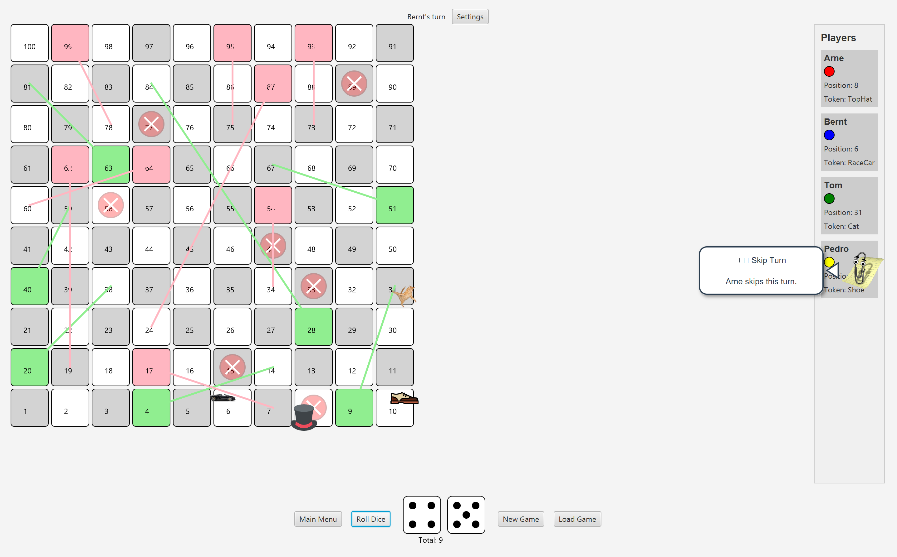

# IDATT2003-MappeV25-Gruppe-21

# BoardGame - Chutes and Ladders

A Java implementation of the classic Chutes and Ladders board game with custom enhancements
This project was developed as part of the IDATT2003 Programming 2 course at NTNU.


## Features
- Chutes and Ladders gameplay
- Multiple board sizes including possibility for custom boards
- Configurable number of dice (1-5)
- Custom player tokens
- Special tile actions
  - Ladders
  - Chutes
  - Skip turn
- Save and load players
- Animated game elements
- Clippy notifications

## Getting started

### Prerequisites
- Java 21 or higher
- Maven 3.6 or higher

### Installation

1. Clone the git repository (or download zip):
    ```bash
   git clone https://github.com/ArvenShadow/IDATT2003-MappeV25-Gruppe-21.git
   cd BoardGame
2. Compile and run:
 
    ```bash
   mvn clean compile javafx:run
   
## How to play

1. Start a new game
2. Select a board
3. Add players
4. Gameplay:
    * Players take turn rolling dice
    * Your token is moved according to the dice roll
    * Land on special tiles to trigger actions
      * Ladders to move up
      * Chutes to slide down
      * Skip turn to miss your next turn
5. Winning: First player to reach the final tile wins

## Project Structure
The project follows an MVC architectural pattern:

### Model: Core game logic
* Board: Represents the game board with tiles
* Tile: Individual tiles
* Player: Player instantiation and information
* Dice: Random number generation for player moves
* TileAction: Special actions when landing on tiles

### View: User interface components
* BoardGameView: Main game interface
* BoardView: Visual representation of the board
* DiceView: Shows the dice
* MainMenuView: Start screen interface
* CharacterSelectionView: Shows character selection interface

### Controller: Connects the model and view
* BoardGameController: Manages game flow and player turns
* CharacterSelectionController: Handles player setup

### Design Patterns Used
* Factory Pattern: For creating board configurations
* MVC Pattern: Separation of concerns between data, presentation, and logic

